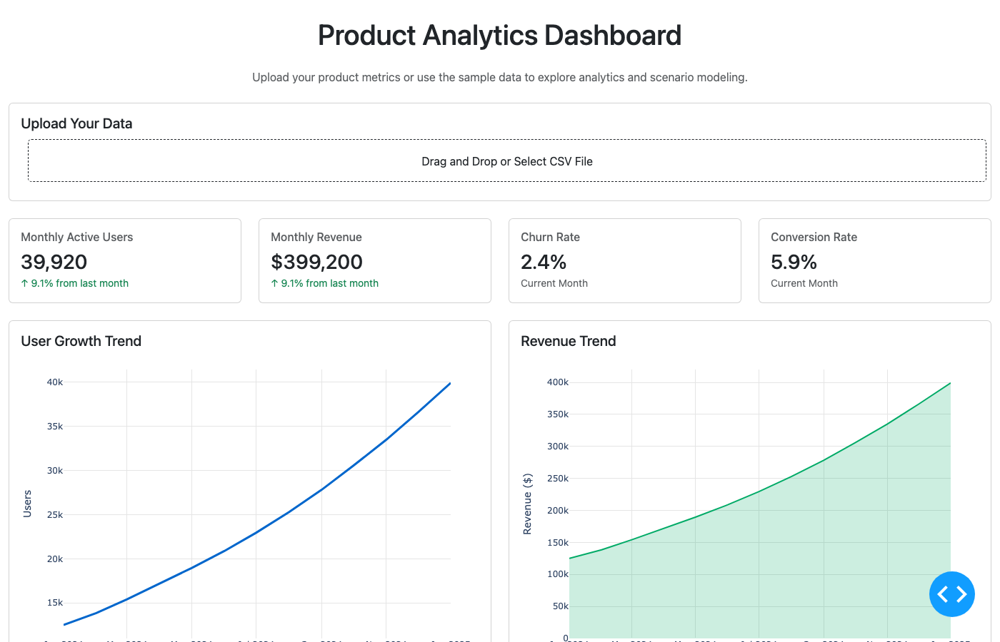
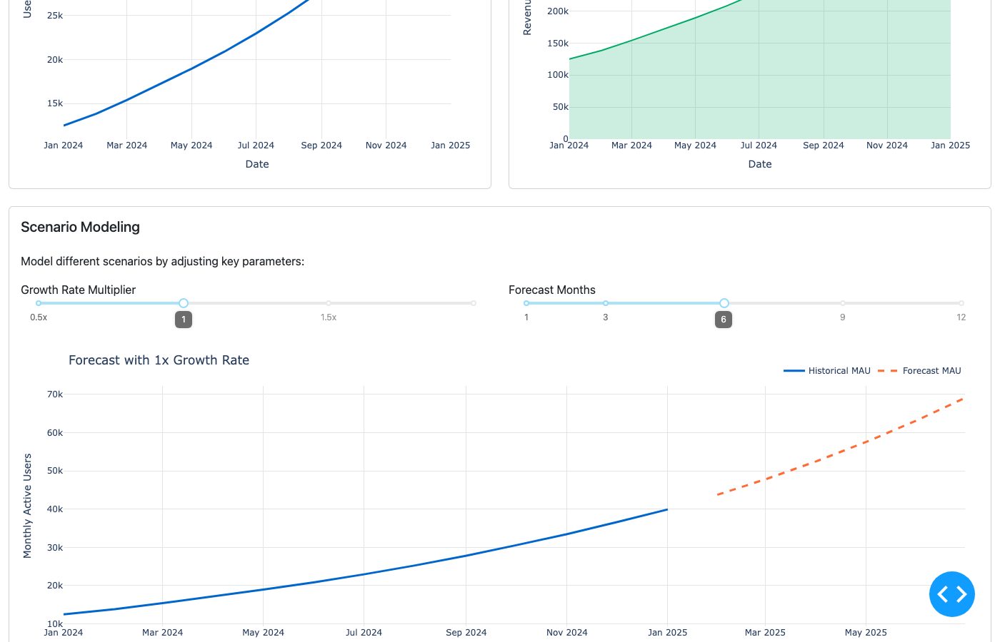

# Product Analytics Dashboard

An interactive product analytics dashboard built with **Python Dash** and **Plotly** for visualizing key product metrics, growth trends, and scenario modeling.

  

## Dashboard Preview

### KPI Cards & Growth Trends


### Scenario Modeling


### Engagement Metrics


## Features

- **KPI Cards** — Monthly Active Users, Revenue, Churn Rate, Conversion Rate
- **Growth & Revenue Trends** — Interactive line and area charts
- **Scenario Modeling** — Adjust growth rate multipliers and forecast months ahead
- **Engagement Analysis** — New signups vs churned users comparison
- **CSV Upload** — Upload your own product data for custom analysis

## Quick Start

```bash
# Clone the repo
git clone https://github.com/Aishwarya-Koppula/product-analytics-dashboard.git
cd product-analytics-dashboard

# Install dependencies
pip install -r requirements.txt

# Run the app
python app.py
```

Open [http://localhost:8050](http://localhost:8050) in your browser.

## Tech Stack

- **Dash** — Web framework for analytical applications
- **Plotly** — Interactive charting library
- **Pandas & NumPy** — Data processing
- **Dash Bootstrap Components** — UI styling

## Project Structure

```
product-analytics-dash/
├── app.py              # Main dashboard application
├── sample_data.csv     # Sample product metrics data
├── requirements.txt    # Python dependencies
├── screenshots/        # Dashboard preview images
└── README.md
```
